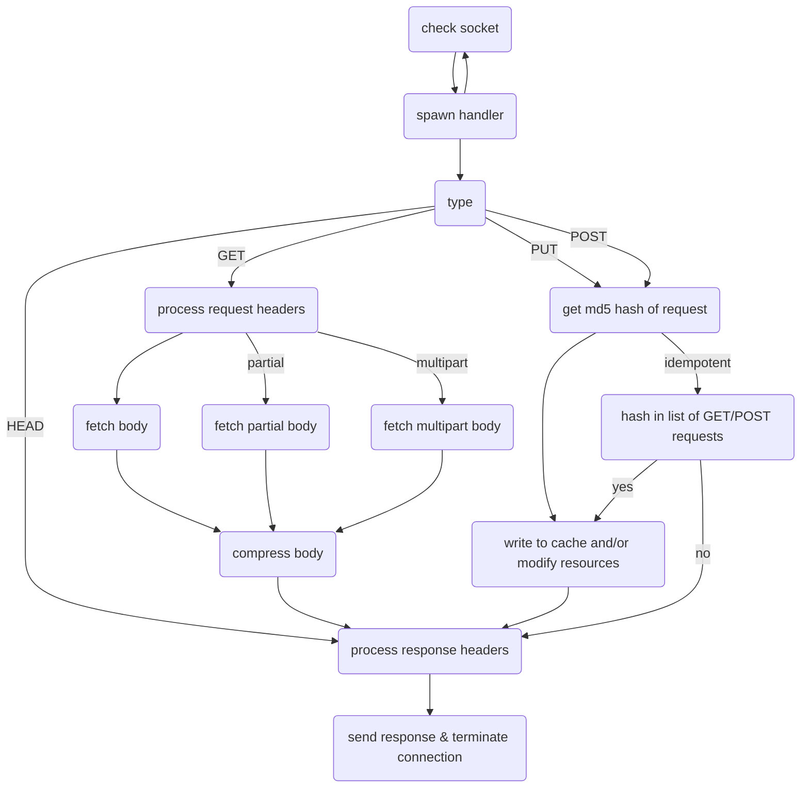

# py-http-server-test

crappy HTTP server written in python

## configuration

configuration is in `server/config.toml`

< documentation goes here >

## goals

- [ ] PUT, POST, GET & HEAD requests
- [ ] multipart ranges
- [ ] compression
- [ ] https
- [ ] simple caching
- [ ] filesystem and table routing

## theory of operation?

awful block of mermaid below

