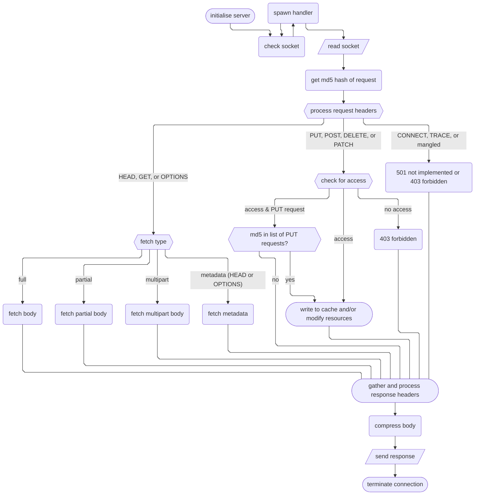

# py-http-server-test

Crappy HTTP server written in python, designed to serve files

## configuration & use

run from within the `server` directory

configuration is in `server/config.toml`

< documentation goes here >

---

## goals

- [x] settings hotloading
- [ ] all http methods bar CONNECT and TRACE
  - [ ] DELETE
  - [ ] GET
  - [ ] HEAD
  - [ ] OPTIONS
  - [ ] PATCH
  - [ ] POST
  - [ ] PUT
- [ ] multipart ranges
- [x] compression
- [ ] cookies support
- [ ] https
- [ ] simple caching
- [ ] filesystem and table routing

---

## theory of operation

internally, configuration is done by `server.py` setting the `CONFIG` global variable in each module to an object that contains all the loaded settings
